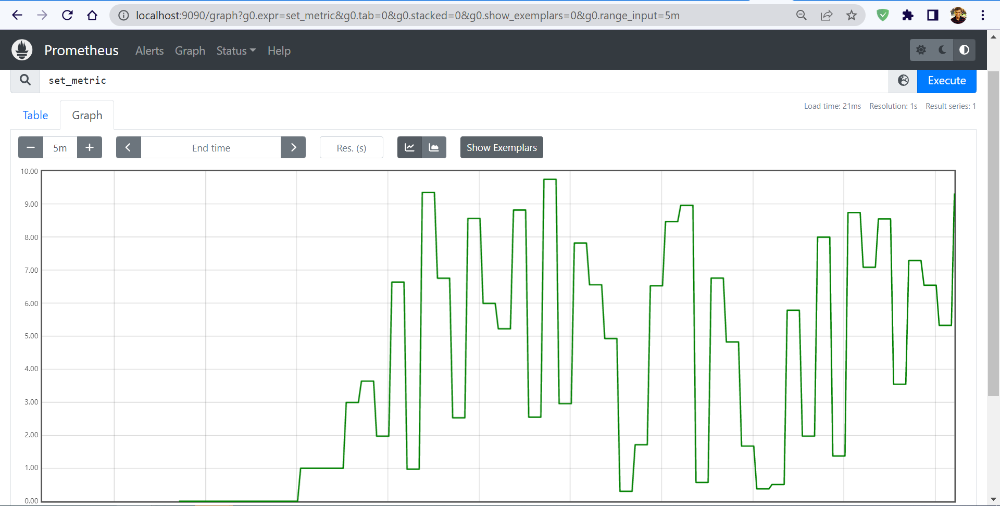

## Demo code for prometheus metrics

It contains an application that has a gauge controller. The controller has a method 
which simulates continues updates.

This repository also contains a configuration for Prometheus, which scrapes the application every 5 seconds.
Both the application and Prometheus are brought up using Docker Compose.

## Pre-requisites

* JDK 11+
* Docker (unless you just want to run the application without Prometheus)

## How to run
If you make any code changes, build the project and copy the jar to the root with
the name: app.jar

Run these commands from the root

`docker-compose build --no-cache`

`docker-compose up`

* application runs at [localhost:8080](http://localhost:8080)
* actuator endpoits are exposed at [http://localhost:8080/actuator/prometheus](http://localhost:8080/actuator/prometheus)
* Prometheus runs at [localhost:9090](http://localhost:9090)

## Stopping

`docker-compose down`

## Results

When we `increment` the Gauge value, even after prometheus has scraped that
particular value, it won't reset and continue incrementing. 

When we `set` the Gauge value, it replaces the existing value irrespective of whether or not that value has 
been collected by Prometheus. In this case, We may suffer data loss of the intermediate values.

